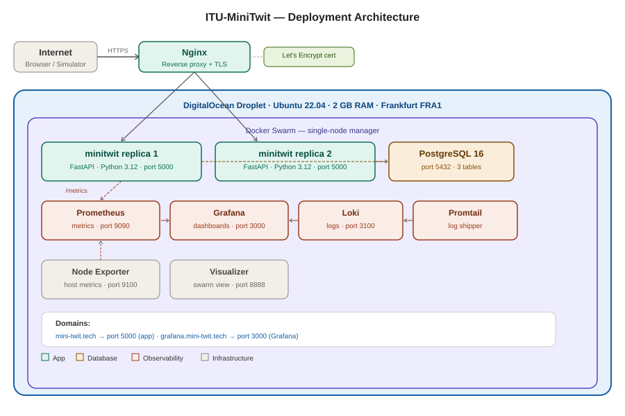
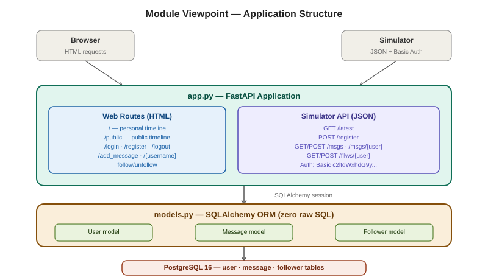
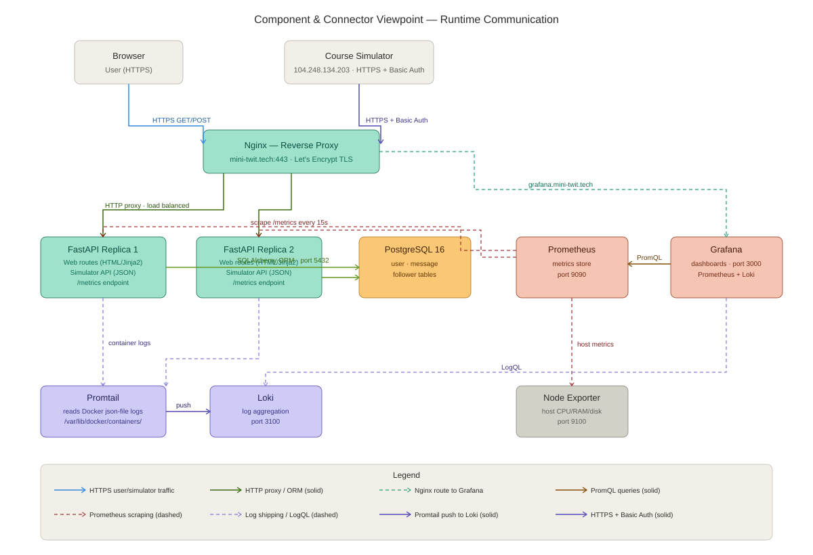
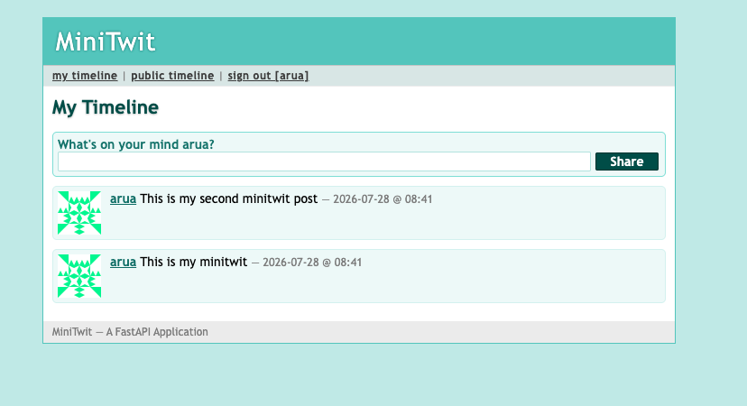
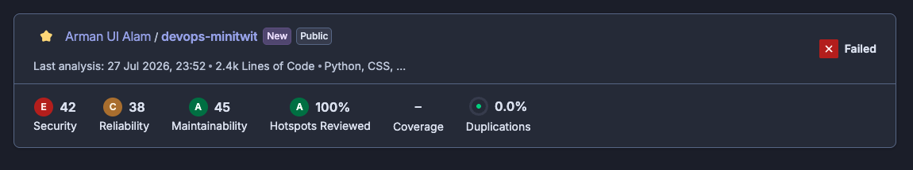
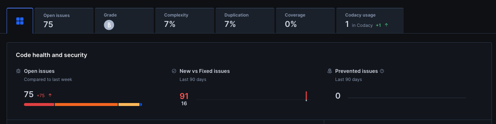
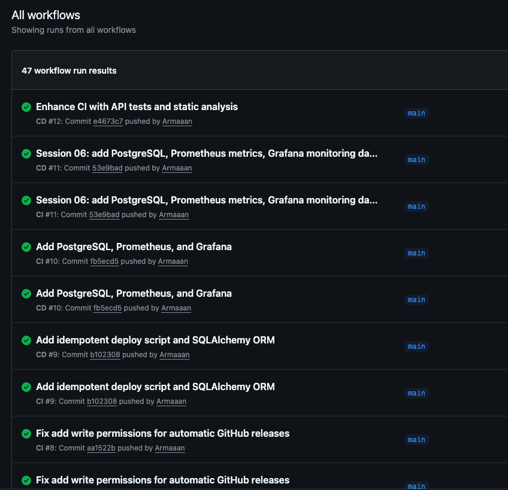
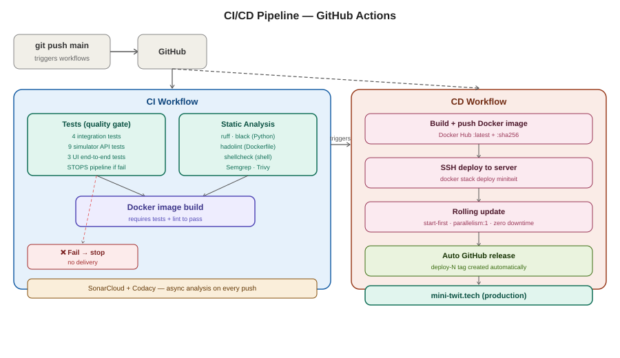
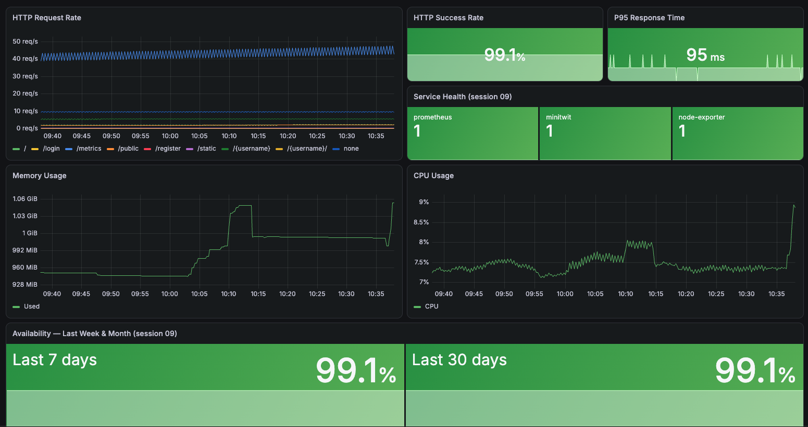

|                        |                                                                        |
| ---------------------- | ---------------------------------------------------------------------- |
| **Repository**         | https://github.com/Armaaan/devops-minitwit                             |
| **Live application**   | https://mini-twit.tech                                                 |
| **Monitoring/Logging** | https://grafana.mini-twit.tech/d/minitwit-dashboard/minitwit-dashboard |
| **Docker image**       | https://hub.docker.com/r/armaaan/devops-minitwit                       |

## 1. System's Perspective

### 1.1 Design and Architecture

The original ITU-MiniTwit application was a single-file Python 2 Flask app. The refactored version of MiniTwit used an architecture that was identical to the previous version but now based on FastAPI.

**Why FastAPI?** In order to improve the design and implementation of the system, I chose to use FastAPI instead of the Flask framework because of its asynchronous capabilities (FastAPI is built on top of Uvicorn, which is an ASGI server that supports concurrency).

In addition, FastAPI provides several advantages when compared to Flask. For example, it generates API documentation automatically based on type hints, which made easy to test the API contract of the simulator. Also, it includes Pydantic for request validation, and finally FastAPI offers much better throughput under high loads compared to WSGI-based frameworks.

Additionally, since FastAPI uses Jinja2 templating, I had very little work to do migrating the HTML templates.

Below you can see the viewpoints for deployment/allocation and module viewports.

#### Deployment/Allocation Viewport:

This viewpoint presents how everything works together. I have a single DigitalOcean droplet running Ubuntu 22.04 and located in Frankfurt FRA1, having an IP address of 46.101.179.118. Inside this droplet, I have a single node Docker Swarm. Nginx is installed on the host machine and acts as a reverse proxy/TLS termination. It directs traffic from mini-twit.tech to the replicas of FastAPI and grafana.mini-twit.tech to Grafana listening on port 3000.

Inside the Swarm I have a total of nine different services: Two replicas of the FastAPI Application (`minitwit_minitwit`), PostgreSQL 16 (`minitwit_db`), Prometheus (`minitwit_prometheus`), Grafana (`minitwit_grafana`), Loki (`minitwit_loki`), Promtail (`minitwit_promtail`), Node Exporter (`minitwit_node-exporter`) and the Swarm Visualizer (`minitwit_visualizer`). All communication among services happen within the Swarm overlay network, via DNS Service Names.

#### Module Viewport:

Here is a description of how the code is organized at the module level. There are really just two files that matter here: `app.py` and `models.py`.

`app.py` is the main entry point into the application where all routing for the web routes (login, register, logout, public timeline, personal timeline, add message, follow/unfollow, etc.) and all simulator API routes (`/api/latest`, `/api/register`, `/api/msgs`, `/api/msgs/{username}`, `/api/fllws/{username}`, etc.), plus exposing `/metrics` via `prometheus-fastapi-instrumentator`. `models.py` defines the three SQLAlchemy ORM models — `User`, `Message`, and `Follower` — and there is not a line of raw SQL anywhere in the entire code base.

The last viewpoint described above is the Component Connector Viewpoint.

#### Component Connector Viewpoint:

This viewpoint shows runtime communication: browsers enter through Nginx on port 443, Nginx load-balances across the two FastAPI replicas, Prometheus scrapes /metrics every 15 seconds, and Promtail ships container logs to Loki.

### 1.2 Dependencies

| Technology                        | Version   | Context                                                   |
| --------------------------------- | --------- | --------------------------------------------------------- |
| Python                            | 3.12      | Development · Production                                  |
| FastAPI                           | 0.140.7   | Development · Production                                  |
| Uvicorn                           | 0.34.2    | Production — ASGI server                                  |
| SQLAlchemy                        | 2.0.51    | Development · Production — ORM                            |
| Jinja2                            | 3.1.6     | Production — HTML templating                              |
| Werkzeug                          | 3.1.7     | Production — password hashing                             |
| psycopg2-binary                   | 2.9.10    | Production — PostgreSQL driver                            |
| python-multipart                  | 0.0.30    | Production — form parsing (↑ from 0.0.20, HIGH CVE)       |
| starlette                         | 0.52.1    | Production — ASGI layer (↑ via FastAPI 0.140.7, HIGH CVE) |
| itsdangerous                      | 2.2       | Production — session cookie signing                       |
| prometheus-fastapi-instrumentator | 7.1.0     | Production — /metrics endpoint                            |
| PostgreSQL                        | 16-alpine | Production — primary database                             |
| Nginx + Certbot                   | —         | Production — reverse proxy + Let's Encrypt TLS            |
| UFW                               | —         | Production — host firewall                                |
| Docker + Swarm                    | 29.1.3    | Production — container runtime and orchestration          |
| Docker Hub                        | —         | CI/CD · Production — image registry                       |
| GitHub Actions                    | —         | CI/CD — pipeline orchestration                            |
| pytest + httpx                    | —         | Development · CI/CD — test suite runner                   |
| Selenium + Firefox/geckodriver    | —         | CI/CD — end-to-end UI tests                               |
| ruff · black                      | —         | Development · CI/CD — Python linting and formatting       |
| hadolint                          | —         | CI/CD — Dockerfile linting                                |
| shellcheck                        | —         | CI/CD — bash script linting                               |
| Semgrep                           | —         | CI/CD — OWASP security scanning                           |
| Trivy                             | —         | CI/CD — Docker CVE scanning                               |
| Docker Scout                      | —         | CI/CD — image vulnerability analysis                      |
| SonarCloud                        | —         | CI/CD — code quality and security hotspots                |
| Codacy                            | —         | CI/CD — code quality gate                                 |
| Prometheus + Grafana              | —         | Production — metrics and dashboards                       |
| Loki + Promtail                   | —         | Production — log aggregation                              |
| DigitalOcean REST API (bash)      | —         | Development — Infrastructure as Code                      |

### 1.3 Current State of the Systems

The system is live at https://mini-twit.tech with a valid Let's Encrypt certificate. Registration, login, posting, following, public and personal timelines, and all five simulator API endpoints work. Uptime was 99.1% over the last 30 days.

**Testing-** The test suite covers three levels. `minitwit_tests.py` has 4 integration tests covering the web routes. `minitwit_sim_api_test.py` has 9 tests covering every simulator API endpoint including the correct HTTP status codes and response shapes the simulator expects. `test_minitwit_ui.py` has 3 Selenium end-to-end tests using Firefox and geckodriver,
running on the GitHub Actions runner against a locally started application instance. The 13 integration and API tests must pass before the Docker image is built. A failing test stops the pipeline. The UI tests run independently with continue-on-error and do not gate delivery.

**Code quality-** SonarCloud last ran on 27 July 2026 against 2.4k lines of Python and CSS. It rates the project Security E (42 issues), Reliability C (38 issues), and Maintainability A (45 issues) with 0.0% duplication. The Security E and Reliability C ratings are partly caused by the preserved `itu-minitwit/` directory. The original legacy Flask code kept in the repository which SonarCloud flags even though it is not part of the running application. All security hotspots have been reviewed (100%).

Codacy rates the project Grade B with 75 open issues, 7% complexity, and 7% code duplication. Coverage shows 0% because the Codacy upload step in CI is misconfigured, the tests run and pass, but the coverage XML report is never forwarded.

**Docker Scout** runs on every CD build and found the following CVEs:

| Package                    | Severity            | Before     | After                        |
| -------------------------- | ------------------- | ---------- | ---------------------------- |
| perl 5.40.1-6 (base image) | 1 CRITICAL + 2 HIGH | Unresolved | No fix available — accepted  |
| python-multipart           | 3 HIGH              | 0.0.20     | Upgraded to 0.0.30           |
| starlette                  | 2 HIGH              | Vulnerable | Upgraded via FastAPI 0.140.7 |

## 2. Process' Perspective

### 2.1 CI/CD Pipelines, Deployment, and Release

Every push to `main` triggers two parallel GitHub Actions workflows. As of submission there are 47 successful runs.

**Why GitHub Actions?** It was the natural choice for a project already on GitHub. No separate CI server to set up or maintain, and the free tier covers public repositories entirely. The one issue I ran into was Docker Hub rate limiting the GitHub-hosted runners, which I fixed by adding authenticated pulls to the workflow.

The CI workflow takes around 18 seconds. Tests run first: minitwit_tests.py covers 4 integration tests and minitwit_sim_api_test.py covers 9 simulator API tests. Any failure stops the pipeline; the image is never built. UI tests run as a parallel job with continue-on-error and do not block delivery. Static analysis comes next: ruff for Python linting, black for formatting, hadolint for the Dockerfile, and shellcheck for the bash scripts. Semgrep then checks for OWASP Top-10 patterns and Trivy scans for Docker CVEs. The image build only runs if all three of those pass. SonarCloud and Codacy run asynchronously on every push and never block delivery.

**Why these static analysis tools?** ruff replaced pylint and flake8 because it is significantly faster, being written in Rust, and handles both linting and import ordering in one tool. black enforces formatting without any configuration debate. hadolint lints the Dockerfile. shellcheck catches bugs in the bash deploy scripts that no Python linter would find.

The CD workflow takes around 60 seconds. It builds the Docker image and pushes it to Docker Hub as `armaaan/devops-minitwit:latest` and with a content-addressed `:sha` tag. It then SSHes into the production droplet and runs `docker stack deploy --with-registry-auth -c docker-stack.yml minitwit`. A GitHub release tagged `deploy-N` is created automatically after every successful deployment. Manual semantic version tags (`v2.0.0` through `v12.0.0`) mark session milestones.

### 2.2 Monitoring and Logging

Prometheus scrapes `/metrics` every 15 seconds from both FastAPI replicas via `prometheus-fastapi-instrumentator`, and from Node Exporter on port 9100 for host-level metrics. The Grafana dashboard is provisioned as code in `monitoring/grafana/dashboards/minitwit.json` so it is never configured manually. It tracks: HTTP request rate by route, HTTP success rate (99.1%), P95 response time (95 ms), service health for prometheus/minitwit/node-exporter, memory usage (~1010 MiB), CPU utilization (~8%), and availability over 7 and 30 days (99.1% for both). Grafana is configured to trigger an alert if the minitwit service health drops to 0.

**Logging.** Promtail runs as a Swarm service with read access to `/var/lib/docker/containers`, tailing the json-file logs from every container and shipping them to Loki on port 3100. Labels collected are `job=containerlogs`, `container_name`, and `stream` (stdout/stderr). Grafana's Explore view queries Loki via LogQL — for example, `{job="containerlogs"} |= "404"` was used to identify the FastAPI route ordering bug described in section 3.1.

### 2.3 Security Assessment

**Risk Identification — Assets and Threat Sources**

Assets: the web application and simulator API endpoint, the PostgreSQL database and user data, server infrastructure (DigitalOcean droplet), and the monitoring stack (Grafana, Prometheus, Loki).

Threat sources identified: SQL injection through user input, unauthorized access to simulator API endpoints, exposure of secrets (database passwords, API keys), container privilege escalation, Docker iptables rules bypassing UFW, and dependency CVEs in third-party packages.

**Risk Analysis and Risk Matrix**

| Risk                                          | Likelihood | Impact   | Risk Level | Mitigation                                                        |
| --------------------------------------------- | ---------- | -------- | ---------- | ----------------------------------------------------------------- |
| SQL injection                                 | Low        | High     | Medium     | SQLAlchemy ORM — zero raw SQL throughout                          |
| Unauthorized simulator API access             | Low        | Medium   | Low        | HTTP Basic Auth on all /api/\* endpoints                          |
| Secret exposure                               | Low        | High     | Medium     | GitHub Actions Secrets; no hardcoded fallback values              |
| Container privilege escalation                | Low        | Medium   | Low        | Non-root `appuser` in Dockerfile                                  |
| Docker/UFW bypass                             | Medium     | High     | High       | Nginx as sole ingress; documented gap requiring DOCKER-USER chain |
| Dependency CVEs (perl base image)             | Low        | Critical | Medium     | No fix available; container isolation as partial mitigation       |
| Dependency CVEs (python-multipart, starlette) | Resolved   | —        | —          | Upgraded via Docker Scout findings                                |

**What was done**

UFW is configured with deny-by-default inbound policy — only ports 22, 80, and 443 are open. HTTPS is provided by Let's Encrypt via Certbot for both `mini-twit.tech` and `grafana.mini-twit.tech`, with auto-renewal. The Dockerfile creates a non-root `appuser` and switches to it before starting Uvicorn. All credentials like database password, Docker Hub token, SSH key, and `SECRET_KEY` are stored as GitHub Actions repository secrets and injected at deploy time. None appear in the repository or in any Docker image layer. Semgrep runs OWASP Top-10 checks in CI. Trivy and Docker Scout scan the Docker image for CVEs on every build.

### 2.4 Scaling and Availability

Docker Swarm runs two replicas of the FastAPI service. The rolling update strategy configured in `docker-stack.yml` uses `order: start-first`, `parallelism: 1`, and `failure_action: rollback` — meaning the new container starts and passes its health check before the old one is terminated, so at least one replica always serves traffic during a deployment. A bad image rolls back automatically without manual intervention.

The migration from `docker-compose` to Docker Swarm was done with approximately zero application downtime. The PostgreSQL data volume (`minitwit_postgres-data`) was a named Docker volume on the host and survived the migration untouched — no `pg_dump`/`pg_restore` was needed. The Docker image already running in Compose was reused directly in Swarm. The only real downtime in the project was the ~5-minute power-cycle to resize the droplet from `s-1vcpu-1gb` to `s-1vcpu-2gb`.

**Infrastructure as Code.** `provision.sh` uses the DigitalOcean REST API via `curl` and `jq` to create a droplet, install Docker, initialise the Swarm, and deploy the full stack from scratch. The whole system can be reprovisioned from zero with a single script. The choice of bash over Terraform was deliberate for this project scale. `bash` requires no additional tooling and makes every API call explicit. The cons are significant at scale: no state file (running twice creates a second droplet), no dependency graph, and manual error handling. Terraform would be the correct choice for a multi-node, multi-environment setup.

## 3. Reflection Perspective

### 3.1 Evolution and Refactoring

**Why FastAPI —** FastAPI was the correct decision due to its native-async design that can deal with the concurrent/requests of the simulator without causing any blocks. Additionally, FastAPI’s Type annotations are used as an open specification of the api while automatically creating OpenAPI documentation for the simulator endpoint contract which could be viewed during development at `/docs` rather than through trial-and-error when sending requests to the live simulator

The most unexpected problem during the refactoring process of FastAPI was the routing of FastAPI. FastAPI defines routes in their definition order, and therefore the wildcard profile route `/{username}` was created prior to defining the routes for the simulator api. Therefore, when making POST requests to `/api/register` they matched `/{username}` and returned a `404` to the simulator for approximately a week.

Additionally, the need for `/register` to accept either browser form-data (`application/x-www-form-urlencoded`) or JSON from the simulator (`application/json`). To resolve this issue I inspected the `Content-Type` header and dispatched to `request.form()` or `request.json()` accordingly.

To convert from Flask’s global session context to FastAPI’s request scoped model required to re-implement cookie-based authentication using `itsdangerous.URLSafeTimedSerializer`. The ORM refactor was relatively straight forward since the ORM schema consisted of simply 3 tables — thus converting from SQLite to PostgreSQL required only changing `DATABASE_URL`.

### 3.2 Operation

**OOM incident.** When adding loki and Promtail I exceeded the memory limits of 1gb droplet. With eight containers running, the os killed Grafana after it had run out of memory and then crash looped. I resolved this by increasing the size of the droplet to 2 GB RAM and consequently experiencing approximately a 5 minute downtime (the only unplanned downtime of significant length throughout the entire project). Lesson learned: be aware of the observability stack’s resource usage prior to deploying it.

**Docker/UFW bypass.** There are gaps in Docker’s iptables rules that allow them to bypass UFW — resulting in port openings such as those needed for Grafana (3000) and loki (3100) being exposed to users accessing via the public IP if you bind them to 0.0.0.0. While Nginx acts as the primary gatekeeper for the application tier — a good way to fully address this gap would be to add rules to the `DOCKER-USER` iptables chain to prevent non-Nginx traffic into those ports. This is well-documented as a known limitation.

**Loki instability.** I experienced three failures of loki connecting to Grafana. first, following the droplet resize loki’s WAL contained a stale IP from the pre-resize network — requiring to wipe out all data in the volume. Second, following the compose-to-Swarm migration, the service name changed from `loki` to `minitwit_loki`, invalidating the Grafana datasource configuration — again requiring a full volume wipe. Finally, provisioning the Grafana datasource as a JSON file from the start would have avoided both of these problems.

**Simulator API bugs.** I discovered Three bugs using test cases and loki logs: 1) `/api/latest` was writing to `/tmp/latest` (this directory is ephemeral — I transitioned it to `/data/latest` on a persisted volume), 2) POST `/register` was returning HTML to the simulator (resolved through route ordering fix), and 3) `/msgs/{username}` was returning 404 (resolved through wildcard placement fix). All Three were found through monitoring — none were reported by a USER.

### 3.3 Maintenance

I performed a mix of proactive and reactive maintenance during the course of this project. Proactively, I updated several versions of github action node.js runtime deprecated warning messages. Similarly, I also reduced codacy’s number of issues from 79 down to 75 by addressing the hardcoded `SECRET_KEY` fallback and duplicate string literals. Reactive maintenance included diagnosing and repairing issues found in logs or dashboards — none of which required architectural rework.

The remaining proactive gap currently is that there is no mechanism to create automated backup copies of the postgres database. As stated previously, postgres data is stored within a named Docker volume on a single droplet — losing this volume results in losing all data. Thus, once deployed in production — creating periodic `pg_dump` exports of the databases to object storage will be the first item on the list of items to do as part of performing routine maintenance activities.

Two other groups' live applications were checked for UI functionality as part of the Software Maintenance II task. Both servers were unreachable at the time of the reexam, consistent with the simulator no longer running.

### 3.4 DevOps Style of Work — The Three Ways

The Three Ways from The DevOps Handbook map directly to the project's practices.

**Flow** (fast left-to-right delivery) — Every push to `main` is live in under 2 minutes. Tests block the build if they fail, preventing bad code from reaching Production. I also encode the infrastructure into Idempotent Scripts instead of Manual Steps. This is why I use `failure_action: rollback` in Swarm, which will roll back bad deployments by themselves.

**Feedback** (fast right-to-left signals) — Grafana and Loki allow us to get real-time production feedback. SonarCloud and Codacy give us code quality feedback within 2 minutes of every Push. The 13 Integration & API Test will tell us if you have correctness issues before your Code even gets built into an Image. Each of the three Major Operational Incidents were Diagnosed using this feedback mechanism, not user reports.

**Continual Learning** (culture of experimentation) — Each Session I introduced a new Tool; immediately applying it to the Running System. The Incident Log is integrated into Commit History: the Loki WAL Fix, Route Ordering Fix, and ORM Rewrite are all Traceable in `git log`.

## Appendix — Use of Generative AI

I used different AI tools depending on the task. Claude (Anthropic) and ChatGPT (OpenAI) supported brainstorming and documentation, and also helped analyse error logs, compare possible solutions, improve code, and polish written reports. ChatGPT was particularly useful for troubleshooting GitHub Actions and Docker issues. GitHub Copilot helped understand and improve the code, build boilerplate, and comment on the code.

AI was most effective for routine tasks and initial guidance. However, its suggestions became less reliable as system complexity increased, and some generated solutions required significant manual correction. I verified all AI-generated code and documentation against the actual system, and I did not blindly accept any suggestions. I also ensured that all final code and documentation were my own work, and I did not submit any AI-generated content as-is.
